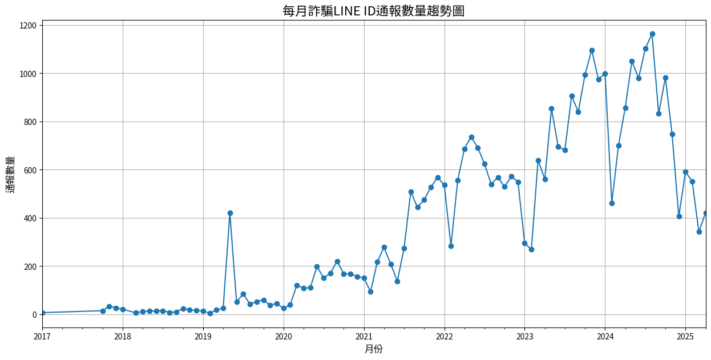
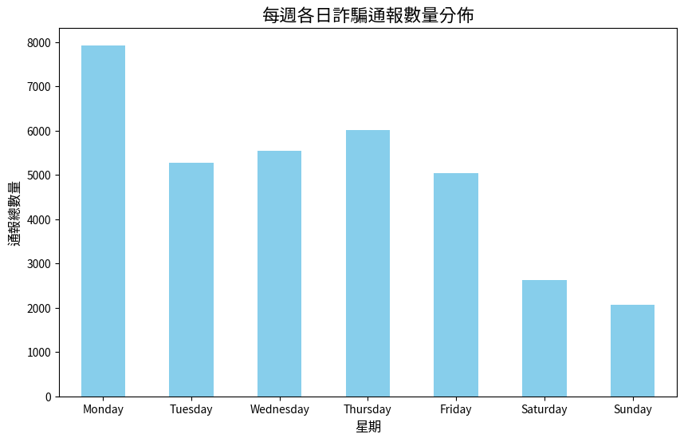

# 詐騙通報趨勢分析專案：從LINE ID通報日期洞察時間模式

*最後更新: 2025年6月21日*

## 專案目標
本專案旨在分析「165全民防騙網」所公布之詐騙LINE ID名單的「通報日期」，透過**時間序列分析**，探索詐騙通報數量的長期趨勢與週期性模式，以了解詐騙活動的消長規律。

## 資料來源
* **資料集名稱:** 165全民防騙網-詐騙LINE ID彙整
* **來源單位:** 內政部警政署刑事警察局
* **下載檔案:** `NPA_LineID.csv` (包含「編號」、「LINE ID」、「通報日期」三欄)

## 分析工具
* **程式語言:** Python
* **核心套件:** Pandas (資料清理與時間序列處理), Matplotlib (資料視覺化)
* **開發環境:** Google Colab

## 分析流程與發現
1. **資料清理與準備:** 讀取資料後，將「通報日期」欄位由文字格式轉換為標準的 `datetime` 日期格式，以利後續分析。
2. **特徵工程:** 從日期格式中，衍生出「年」、「月」、「星期幾」以及「年月」等新的特徵欄位，以便從不同時間維度進行聚合分析。
3. **核心發現:**
    * **長期趨勢:** 從每月通報數量的折線圖來看，詐騙通報數量呈現 **[請根據你的圖表填寫，例如：逐年顯著上升的趨勢]**。
    * **週期性模式:** 在每年當中，通報數量高峰通常出現在 **[例如：第三季 (7-9月)]**。在一週之內，通報數量在 **[例如：週一]** 達到高峰，並在 **[例如：週末]** 下降，這可能與民眾在工作日處理事務的習慣有關。

### 每月詐騙通報數量趨勢圖

### 每週各日詐騙通報數量分佈圖

## 專案價值
本專案展示了從單一的時間欄位中，透過特徵工程與聚合分析，挖掘出多維度商業洞察的能力。理解詐騙活動的時間模式，有助於在高峰期前加強宣導、預先配置應對資源，更精準地打擊犯罪。

---
